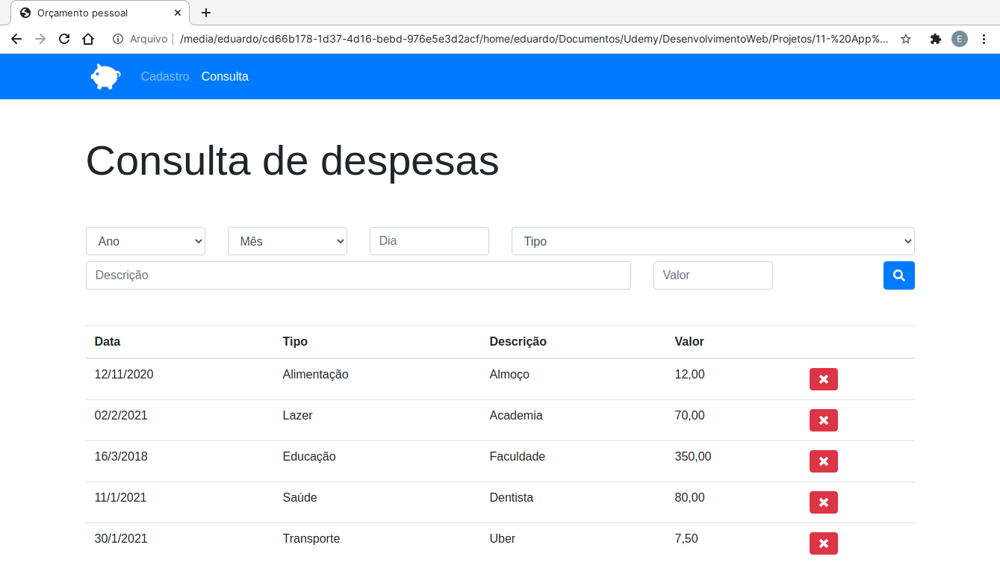
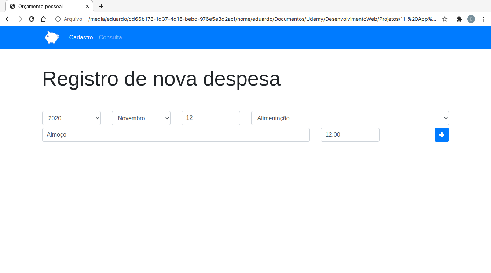
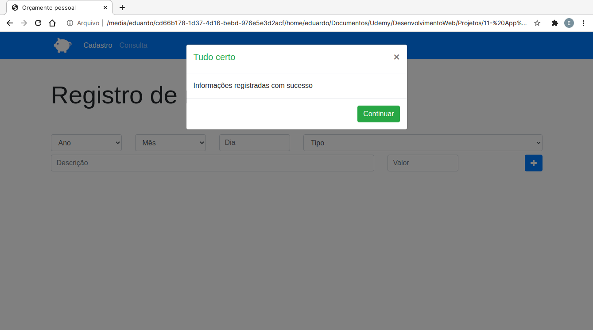
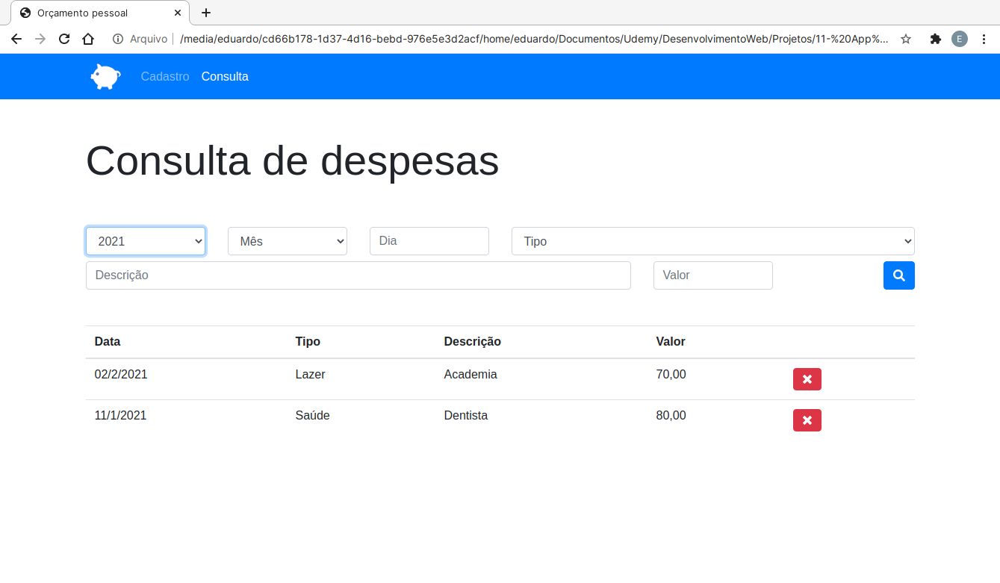

<h1>Projeto App Finanças</h1>

Projeto desenvolvido durante o curso de Desenvolvimento Web.

<h3>Descrição:</h3>

O projeto consiste em um aplicativo que permite o cadastro de despesas, podendo o usuário categorizar cada despesa por:

<ul>
    <li>
        <strong>Data (Ano, mes, dia)</strong>
    </li>
    <li>
        <strong>Tipo (Alimentação, educação, lazer, saúde, transporte)</strong>
    </li>
    <li>
        <strong>Descrição (O usuário descreve a despesa)</strong>
    </li>
    <li>
        <strong>Valor (Valor da despesa)</strong>
    </li>
</ul>

O usuário também pode consultar todas as despesas na tela de consulta, podendo filtrar a exibição das despesas com as mesmas informações utilizadas para cadastrar (Ano, mes, dia, tipo, descrição, valor)

Também é possível excluir qualquer despesa cadastrada

<h3>Tecnologias:</h3>
<ul>
    <li>
        <strong>HTML 5</strong>
    </li>
    <li>
        <strong>CSS 3</strong>
    </li>
    <li>
        <strong>Javascript</strong>
    </li>
    <li>
        <strong>Bootstrap 4</strong>
    </li>
</ul>