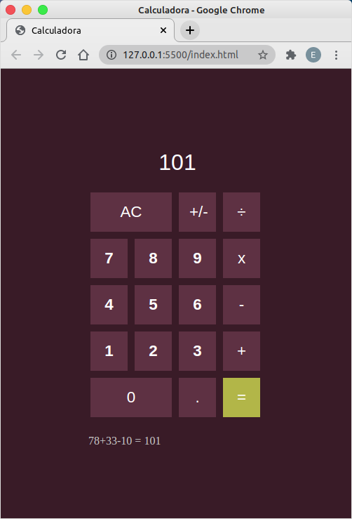
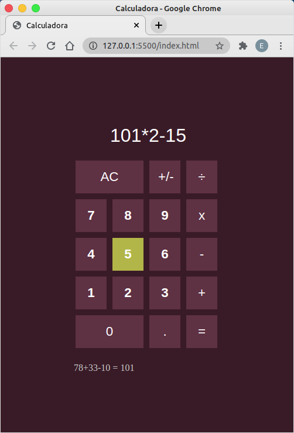
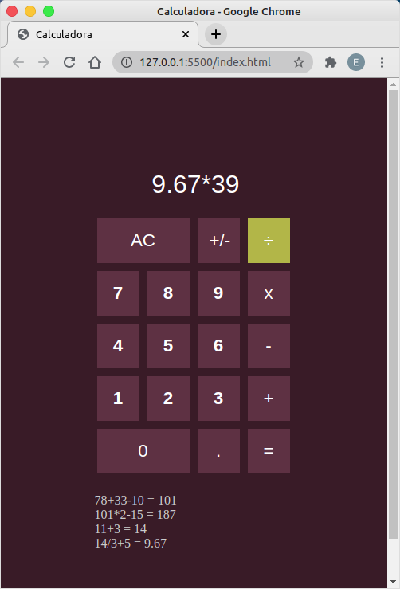

<h1 align="center">Calculadora</h1>

Calculadora simples implementada com o objetivo de colocar em pratica alguns conceitos de HTML/CSS/Javascript

<h1 align="center">
  
</h1>

<h1 align="center">
  
</h1>

<h1 align="center">
  
</h1>

<h3 align="center">Informações</h3>

Sempre que solictado o resultado da operação, as informações contidas no visor são exibidas para o usuário no historico que fica abaixo da calculadora.

Os calculos são feitos automaticamente através da função eval().

<h3 align="center">Desafios</h3>

Nos casos de dízima periódica todo o visor da calculadora era preenchido.

Foi utilizado o método toFixed(2) para limitar o numero de casas decimais para dois digitos no caso de valores com casas decimais, porém os valores inteiros também estavam sendo exibidos com casas decimais.
 
Foi então implementada uma lógica para exibir de forma correta no visor os números inteiros sem as casas decimais e os números reais com duas casas decimais.

