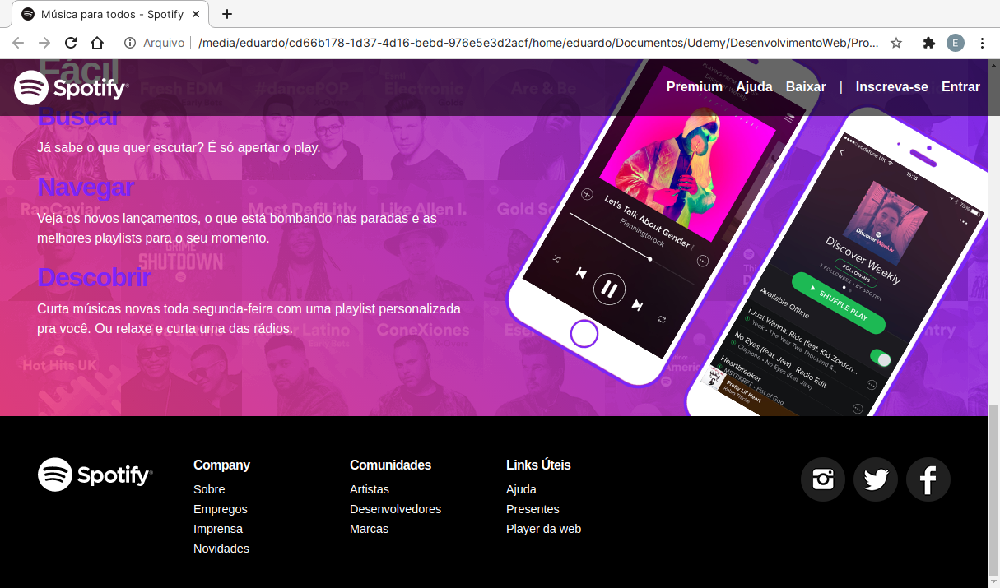

<h1>Projeto Spotify Clone</h1>

Projeto desenvolvido durante o curso de Desenvolvimento Web.

<h3>Descrição:</h3>

O projeto foi desenvolvido com o objetivo de colocar em prática todos os conhecimentos adquiridos até o momento ultilizando as seguintes tecnologias:

<ul>
    <li>
        <strong>HTML 5</strong>
    </li>
    <li>
        <strong>CSS 3</strong>
    </li>
    <li>
        <strong>Bootstrap 4</strong>
    </li>
</ul>

<h3>O projeto é totalmente responsivo, funcionando bem em qualquer tamanho de tela:</h3>

