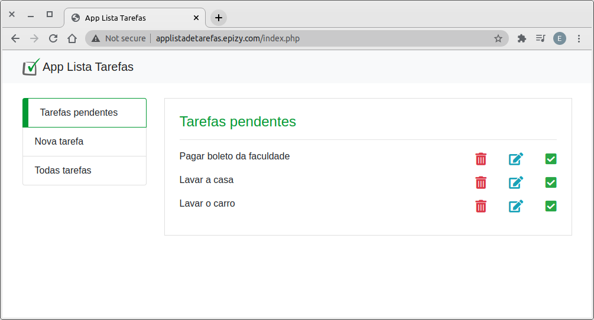
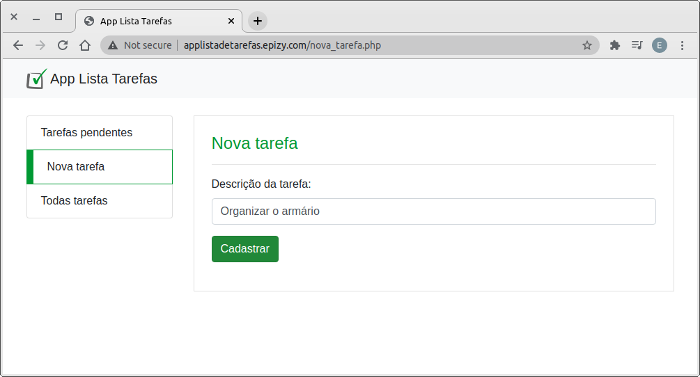
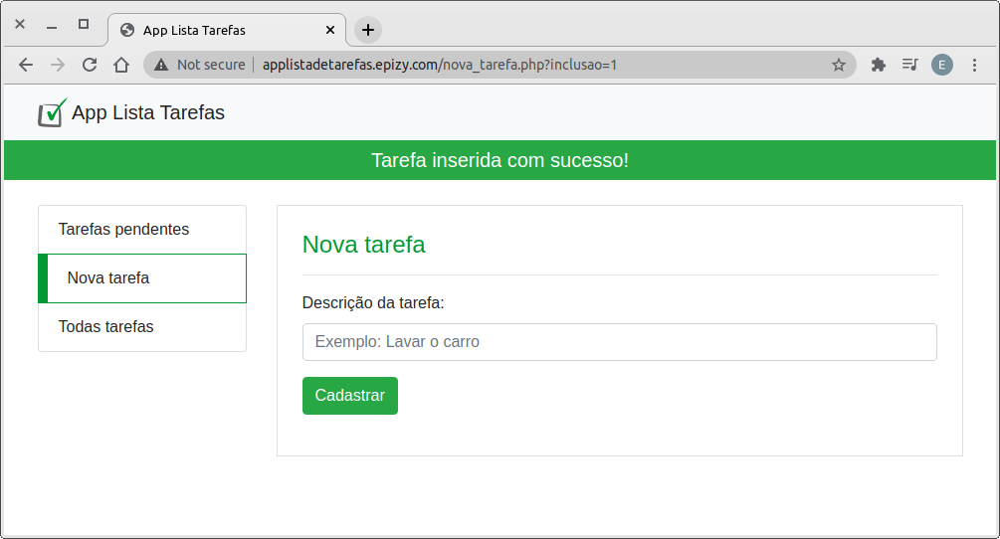
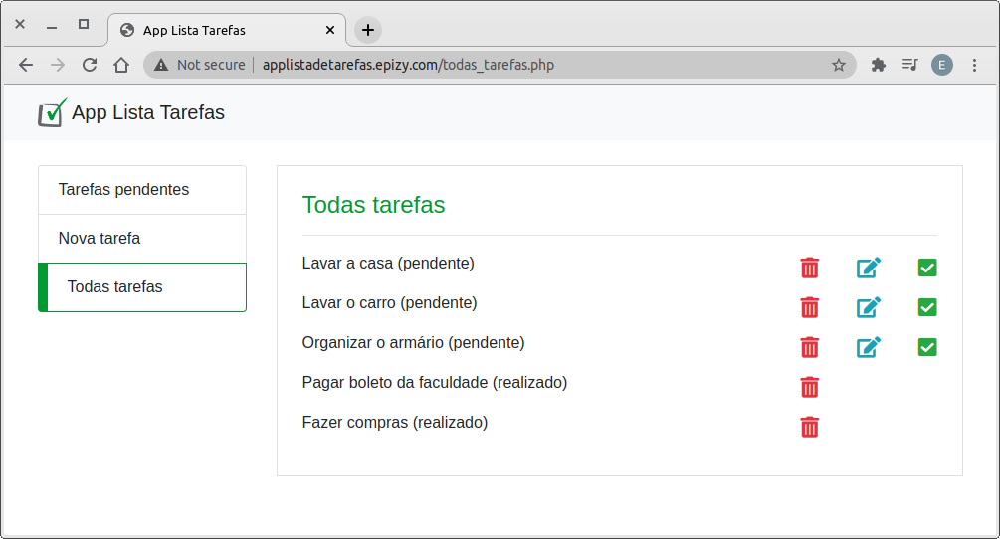

<h1>App lista de tarefas</h1>

Projeto realizado durante o curso de Desenvolvimento Web.

Este projeto foi realizado para colocar em prática as habilidades de desenvolvimento:

<ul>
	<li>Front End utilizando HTML/CSS/JS e Bootstrap.</li>
	<li>Back End utilizando PHP 7 com banco de dados MySQL.</li>
</ul>
<h3>Sobre o projeto</h3>

O projeto consiste em um site onde é possível inserir uma lista de afazeres. Além de inserir as tarefas, o usuário pode editar qualquer tarefa que já foi inserida, bem como excluir qualquer tarefa e até mesmo modificar o status da tarefa de pendente para realizada.

<h3>Link para testar o projeto</h3>
<a href="http://applistadetarefas.epizy.com/">applistadetarefas.epizy.com</a>
<h3>Imagens do projeto</h3>

